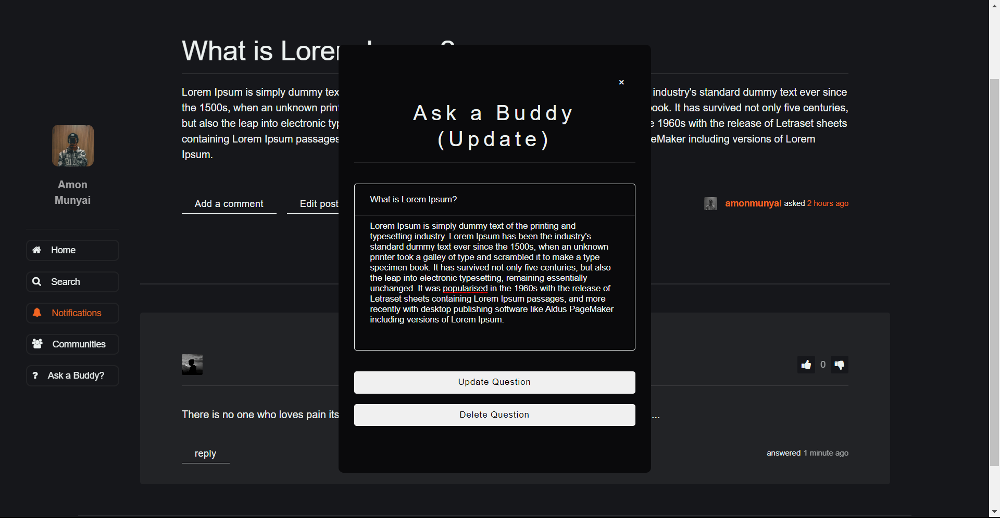

## myBuddy

myBuddy is a PHP based website that helps students find the answers they need, when they need them. It is a tool for empowering students to find what they need to ace student life, get ahead with course material, and build a thriving campus social life.

## Table of Contents

- [myBuddy](#mybuddy)
- [Features](#features)
- [Getting Started](#getting-started)
- [Project Structure](#project-structure)
- [Documentation](#documentation)
- [Future Scope](#future-scope)
- [Authors](#authors)
- [Acknowledgements](#acknowledgements)

## Features

- **Homepage**: The homepage is the first thing that users will see when they visit the website. It provides an overview of the website.
- **Student Profiles**: Allows students to create profiles. Profiles include basic information such as their name and last name. Students can also add a profile picture.
- **Forum**: The forum is a space where students can ask and answer questions about their university. This includes and not limited to questions about academics, campus life, or extracurricular activities. This feature also includes a search function making it easy for students to find the information they need.
- **Blog or News Section**: Creating a blog or news section with updates on university news and events to keep students informed and engaged. This includes articles written by the [University of Johannesburg](https://www.uj.ac.za/) staff, and updates on university policies and/or initiatives.

## Getting Started

- Download [XAMMP](https://www.apachefriends.org/index.html) or other
- Start Apache and MySQL
- Clone or Download [myBuddy](https://github.com/AmonMunyai/my-buddy/archive/refs/heads/main.zip)
  - Extract this folder in xammp htdocs as `mybuddy`
  - Access the website with [localhost/mybuddy](http://localhost/mybuddy/)
- Import [mybuddy.sql](https://github.com/AmonMunyai/my-buddy/blob/main/database/mybuddy.sql) to [PHPMyAdmin]
  - Go to `localhost/phpmyadmin`
  - Select `Import` menu from the top
  - Click `Choose File` button and select `mybuddy.sql`
  - Press `Import` at the bottom of the screen

## Project Structure

| Name                                | Description                                                            |
| ----------------------------------- | ---------------------------------------------------------------------- |
| **core**/functions.php              | Contains function definitions                                          |
| **core**/init.php                   | Initiliazes database connection and definition of global constants     |
| **post**/**answers**/add_answer.php | Inserts answer comments to database                                    |
| **post**/**answers**/vote.php       | Increment, decrement post_answer_number_of_votes                       |
| **post**/create_post.php            | Inserts user post question to database                                 |
| **post**/notification_clear.php     | Removed user notifications                                             |
| **post**/question.php               | Displays the post question, based on it's id                           |
| **post**/update_post.php            | Updates the post question content                                      |
| **public**/**assets**/**images**/   | Contains the websites image assets                                     |
| **public**/**css**/                 | Contains all the css styling for the website                           |
| **public**/**js**/                  | Contains the javascript scripts, for the website                       |
| **shared**/header.php               | Header section of the html document                                    |
| **shared**/content.php              | Body section of the html document                                      |
| **shared**/navbar_left.php          | Left navigation side bar of the html document                          |
| **shared**/content.php              | Header section of the html document                                    |
| **shared**/modal.php                | Contains the modal section of the html document                        |
| **shared**/footer.php               | Footer section of the html document                                    |
| **shared**/redirect.php             | Redirects user's to homepage if they are not logged in                 |
| **users**/**password**/forgot.php   | Handles password forgot functionality                                  |
| **users**/**password**/new.php      | Update password page                                                   |
| **users**/**password**/reset.php    | Resets user password and updates with new password                     |
| **users**/join.php                  | Inserts user into database                                             |
| **users**/logout.php                | Logs out user from current session                                     |
| **users**/remove_avatar.php         | Removes the current avatar image and replaces with blank profile image |
| **users**/sign_in.php               | Signs user in                                                          |
| dashboard.php                       | Home page                                                              |
| index.php                           | Landing page                                                           |

## Documentation

If you're having trouble, examples of how to use myBuddy for common scenarios can be found in the examples folder.

| landingPage                              |
| ---------------------------------------- |
|        |
| createAccount                            |
|      |
| signIn                                   |
|             |
| forum                                    |
|              |
| addPost                                  |
|            |
| viewPost                                 |
|           |
| addAnswer                                |
|          |
| viewNotifications                        |
|  |
| updatePost                               |
|         |
| updateProfile                            |
|      |
| resetPassword                            |
|      |

## Future Scope

- [ ] **Exercises**: Allowing students to create their own exercises and quizzes is a great way to promote active learning. Students could create exercises related to their course, or exercises that help them study for exams. Other students could then take these exercises and offer feedback, creating a collaborative learning environment.
- [ ] **Calendar**: The calendar is a great way to keep students informed about upcoming events and activities on campus. This could include things like club meetings, guest lectures, and sporting events. The calendar could be customizable, allowing students to filter events based on their interests or course.
- [ ] **Map**: Providing a map of the university and its buildings is a helpful tool for new students who may be unfamiliar with the campus. The map could include information about each building, such as its name, purpose, and hours of operation.
- [ ] **Clubs and Communities**: Providing a directory of clubs and communities on campus is a great way for students to get involved and meet new people. The directory could include information about each club, such as its purpose, meeting times, and contact information. Students could also create their own groups, which could be added to the directory.
- [ ] **Academic and Career Resources**: Providing resources for academic and career development is a great way to support students beyond the classroom. This could include study tips, job search advice, or information about internships and career fairs.
- [ ] **Feedback Section**: Finally, offering a feedback section where students can submit suggestions and comments about the website is a great way to ensure that the website is meeting their needs. This could include a simple form that allows students to submit feedback anonymously, or a more interactive section that allows students to engage in discussions about the website.

## Authors

- [TA MUNYAI](https://github.com/AmonMunyai) - Initial Idea & Work
- T GEMBY - Contributor
- SS MHLONGO - Contributor
- MM MOKOENA - Contributor
- T MOKOTEDI - Contributor

## Acknowledgements

- [@mahon3d](https://stackoverflow.com/users/1179459/mahen3d) - for idea of how to implement [time_elapsed_string](https://stackoverflow.com/questions/1416697/converting-timestamp-to-time-ago-in-php-e-g-1-day-ago-2-days-ago) function
- [@dani krossing](https://www.youtube.com/@Dani_Krossing/) - for great beginner friendly php course
- dsw02A1 tutors - for feedback, ideas and code reviews.
